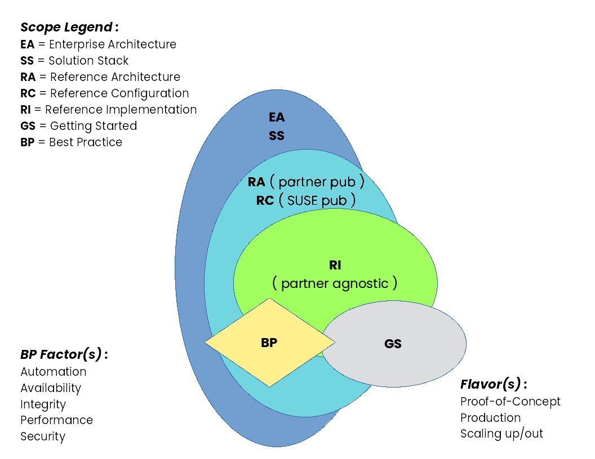

Content:
- Rancher (refer to [TRD-Kubernetes-RA](./TRD-Kubernetes-RA) for a general configuration template) (e.g. SUSE Rancher, K3s ... coming soon RKE1, RKE2)
  - Getting Started (GS)
    - simplified deployment for a PoC or just to try functionality for the focused SUSE component
  - Reference Implementation (RI)
    - stacked, layered deployment of SUSE components as a basis for production
  - Reference Configuration (RC)
    - incorporate partner offerings with SUSE components for a more complete solution

Output Creation:
- Assumptions
  - review tutorial - https://github.com/bwgartner/AsciiDoc-to-DAPS
  - install DocBook Authoring and Publishing Suite DAPS ( https://github.com/openSUSE/daps ) ... suggest installation of 3.1.x version or later
  - the overall template is based upon the RA flavor of Solution Architecture template ( https://github.com/bwgartner/SA-template )
- Process
  - git clone this repo (and either regularly fetch/pull to stay current)
    - many technical reference documents (TRD) can come from this repository
  - change directory to the local path where the cloned content resides
  - determine which type of document to generate ,  see [SA-Glossary.adoc](./adoc/SA-Glossary.adoc) for descriptions
    - Getting Started (GS)
    - Reference Implmentation (RI)
    - Reference Configuration (RC) ... citing this example for the remainder
  - utilize the [Makefile](./bin/Makefile) to generate completed variations, via provided local [Makefile.cf](./bin/Makefile.cf) or a subset and/or superset, via Makefile.override of the document types for all the focus areas, with multiple layered components for whatever output format you desire:
    - ./bin/Makefile <output-format>
      - where <output-format> = epub, html, html --single, pdf
      - then look in the generated, respective [build](./build) directory
    - note the key attributes (as shown as command like arguments in the [Makefile](./Makefile) that should be enabled for a document build (and referring to the [TRD-Kubernetes-RA](./TRD-Kubernetes-RA) as that catalog of all attributes)
      - ADOC_ATTRIBUTES+=" --attribute RC=1"
      - adjust/enable the focus and layer attributes
        - focusPROD : to represent the top level SUSE product
        - layersPROD : to include the respective SUSE products for the referenced layers
    - for an RC variant, you will likely also need to adjust inclusion of partner attributes (ISV, IHV, CSP)
      - e.g. for an IHV partner
        - ADOC_ATTRIBUTES+=" --attribute iIHV=1"
        - ADOC_ATTRIBUTES+=" --attribute IHV-Partner=1"
        - ADOC_ATTRIBUTES+=" --attribute IHV-Partner-Platform=1"

Content Modification / Validation / Submission
- Then you can progressively edit the various AsciiDoc snippets in [./adoc](./adoc) throughout the structure that are associated with the attributes you enable and name/value pairs and regenerate the output formats.
- Once satisfied with the generated outputs
  - create (or modify) a peerDirectory (documentType-focusPROD, e.g. RI-Rancher)
    - cd ../peerDirectory
      - in that peer directory, ensure the following symlinks are in place
        - for f in adoc images media build
            do
              ln -s ../RA/$f .
            done
        - then add a symlink for the respective DAPS config file
            e.g. ln -s ../RA/DC-TRD-Kubernetes-RC-Rancher-K3s-SLES-HPE-Synergy .
      - ensure this peer directory is complete and valid, by executing the following command
          daps --force -d <respective DC-file> <output-format>
      - review the generated output (in the [./build](./build) directory
  - once satisfied and ready to be published, then
    - modify the respective DC-file, commenting out the DRAFT=yes line
    - create a [GitHub pull request](https://docs.github.com/en/github/collaborating-with-pull-requests/proposing-changes-to-your-work-with-pull-requests/about-pull-requests) to have the repo moderator review completed and prepped for official output generations

