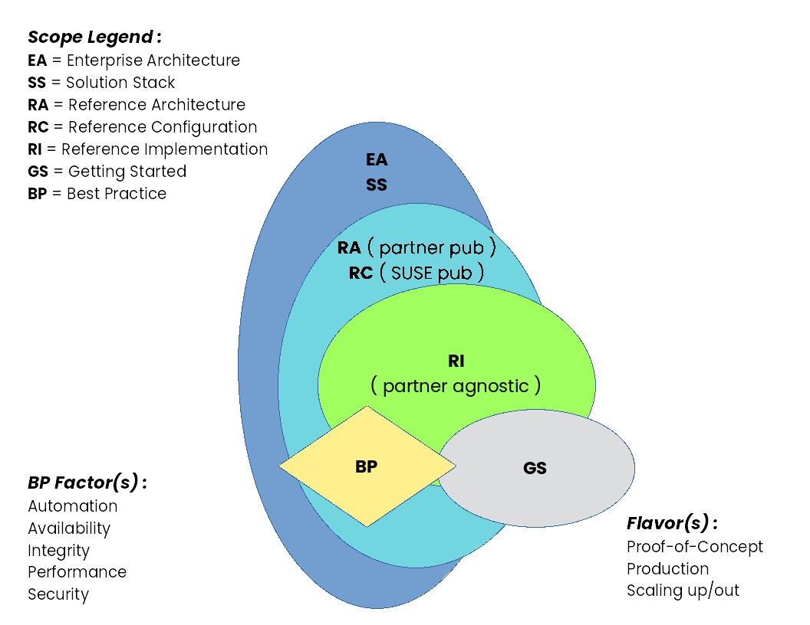

Content:
- Rancher (refer to [TRD-kubernetes-reference](./TRD-kubernetes-reference) for a general configuration template) (e.g. SUSE Rancher, K3s ... coming soon RKE1, RKE2)
  - Getting Started (GS)
    - simplified tutorial launch deployment for a PoC or just to try functionality for the focused component
  - Reference Implementation (RI)
    - introductory deployment of stacked, layered deployment of SUSE components as a basis for usage
  - Reference Configuration (RC)
    - incorporate partner offerings with SUSE components for a more completely functional solution

Output Creation:
- Assumptions
  - review tutorial - https://github.com/bwgartner/AsciiDoc-to-DAPS
  - install DocBook Authoring and Publishing Suite DAPS (https://github.com/openSUSE/daps) ... suggest installation of 3.1.x version or later
  - the overall template used is based upon the RA flavor of Solution Architecture template (https://github.com/bwgartner/SA-template)
- Process
  - git clone this repo (and either regularly fetch/pull to stay current)
    - many Technical Reference Documentation (TRD) can come from this repository
  - change directory to the local path where the cloned content resides
  - determine which type of document to generate ,  see [SA-Glossary.adoc](./adoc/SA-Glossary.adoc) in raw mode for descriptions
    - Getting Started (GS)
    - Reference Implmentation (RI)
    - Reference Configuration (RC) ... citing this example for the remainder
  - utilize the [Makefile](./bin/Makefile) to generate completed variations, via provided local [Makefile.cf](./bin/Makefile.cf) or a subset and/or superset, via Makefile.override of the document types for all the focus areas, with multiple layered components for whatever output format you desire:
    - ./bin/Makefile <output-format>
      - where <output-format> = epub, html, html --single, pdf
      - then look in the generated, respective [build](./build) directory
    - note the key attributes (as shown as command like arguments in the [Makefile](./Makefile) that should be enabled for a document build (and referring to the [TRD-kubernetes-reference](./TRD-kubernetes-reference) as that catalog of all attributes)
      - ADOC_ATTRIBUTES+=" --attribute RC=1"
      - adjust/enable the focus and layer attributes
        - focusPROD : to represent the top level SUSE product
        - layersPROD : to include the respective SUSE products for the referenced layers
    - for an RC variant, you will likely also need to adjust inclusion of partner attributes (ISV, IHV, CSP)
      - e.g. for an IHV partner
        - ADOC_ATTRIBUTES+=" --attribute iIHV=1"
        - ADOC_ATTRIBUTES+=" --attribute IHV-Partner=1"
        - ADOC_ATTRIBUTES+=" --attribute IHV-Partner-Platform=1"

Content Modification / Validation / Submission
- Then you can progressively edit the various AsciiDoc snippets in [./adoc](./adoc) throughout the structure/sub-directories that are associated with the attributes you enable and name/value pairs and regenerate the output formats.
  - NOTE: every portion of text that cites "FixMe" is a flag to encourage modification
  - in the top-level directory
    - for the default configuration/structure (chapter/section/sub-section)
      - review the DAPS configuration templatee [TRD-kubernetes-reference](./TRD-kubernetes-reference)
        - verify the global ADOC_ATTRIBUTES+=" --attribute RA=1" line is uncommentd to toggle to this variant
          - then re-do the above validation step to generate the target output
        - as needed/desired, also review/edit the same section's set of ADOC_ATTRIBUTES to match what content you with to provide
  - in the main "adoc" directory
    - review the [adoc/SA.adoc](./adoc/SA.adoc) main file that pulls in the selected sections
      - if the respective ADOC_ATTRIBUTES value is set (value = 1 and uncommented) in the DAPS config file, then the conditional "ifdef" will include that content in the output
    - review/edit the [adoc/SA_vars.adoc](./adoc/SA_vars.adoc) file to change global variable settings, like
      - companyName
      - title (relative to your attribute setting)
      - github references
    - review/edit the general sections, that are generally included
      - Summary : [adoc/SA-Summary.adoc](./adoc/SA-Summary.adoc)
    - review/edit the general sections, that your ADOC_ATTRIBUTES settings will include
      - References : [adoc/SA-References.adoc](./adoc/SA-References.adoc)
      - Glossary : [adoc/SA-Glossary.adoc](./adoc/SA-Glossary.adoc)
      - Appendices : [adoc/SA-Appendix.adoc](./adoc/SA-Appendix.adoc)
      - Legal Notice + Document License
    - the corresponding layers of an enterprise architecture, which correspond to the suggested chapters, as noted below
      - RA-Introduction  : [adoc/i/SA.adoc](./adoc/i/SA.adoc)
      - RA-BusinessProblemBusinessValue (BPBV) : 2/ii [adoc/ii/SA-RA-BPBV.adoc](./adoc/ii/SA-RA-BPBV.adoc)
      - RA-Requirements : 3/iii [adoc/iii/SA-RA-Requirements.adoc](./adoc/iii/SA-RA-Requirements.adoc)
      - RA-ArchitectureOverview : 4/iv [adoc/iv/SA-RA-ArchOv.adoc](./adoc/iv/SA-RA-ArchOv.adoc)
      - RA-ComponentModel (CompMod) : 5/v [adoc/v/SA-RA-CompMod.adoc](./adoc/v/SA-RA-CompMod.adoc)
      - RA-Deployment : 6/vi [adoc/vi/SA-RA-Deployment.adoc](./adoc/vi/SA-RA-Deployment.adoc)
      - in each of these chapters' directories, you will notice the main SA.doc references, via ifdef, and will utilize the alternative file content from SA-RA-layerName.adoc and more modules of content.
        - so you typically don't need to edit/touch each chapter's SA.adoc
    - review/edit the chapter/section/sub-section content, that you wish to include
  - miscellaneous 
    - you can also add images/media content as needed in those subdirectories
    - do not forget to check in your iterations as well to have a source repository and ability to rollback to a known working state

- Once satisfied with the generated outputs and are ready to be published, then
  - modify the respective DC-file, commenting out the DRAFT=yes line
  - create a [GitHub pull request](https://docs.github.com/en/github/collaborating-with-pull-requests/proposing-changes-to-your-work-with-pull-requests/about-pull-requests) to have the repo moderator review completed and prepped for official output generations

Peer Review:
- Prep work
  - review [SUSE Documentation Style Guide](https://documentation.suse.com/style/current/single-html/docu_styleguide/index.html)
  - for Technical Reference Documentation (TRD), refer to the [TechnicalRefDocsVennDiagram](./media/src/png/TechnicalRefDocsVennDiagram.png) to get an overview of document type/scope/factors/flavors) and [adoc/SA-Glossary.adoc](./adoc/SA-Glossary.adoc)

- Suggested Approach ... for any of generated output in [build](./build)
  - use a viewing tool that allows annotations/comments to be saved
  - scan/read the entire document from start to finish, then
    - assume you are one of the roles listed in the Audience section, and revisit from beginning to end to
      - capture any of the following feedback, issues, suggestions for
        - each included hyperlink is working and is relevant content
        - spelling/punctuation/capitalization corrections
        - grammar, syntax, acronyms, unit measurements
        - relevance/completeness of advisory admonitions
          - warning/important/tip/note
        - ensure figures/tables are appropriate and sufficiently explained/used
        - look for and call-out any "FixMe" text/image flags
        - any perceived missing information that should be included
    - and, if possible, try the actual deployment commands to validate the process
  - then send your saved copy of the document plus your feedback to the author or to the respective repository contributors
